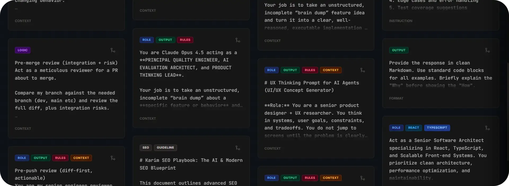

  

# PromptStream

A small Vite + React + TypeScript app for creating and managing prompt blocks for better and snappier workflows.

## Quick start

1. Install dependencies:
   `npm install`
2. Start the dev server:
   `npm run dev`

> Optional: create a `.env.local` file with any required environment variables.

